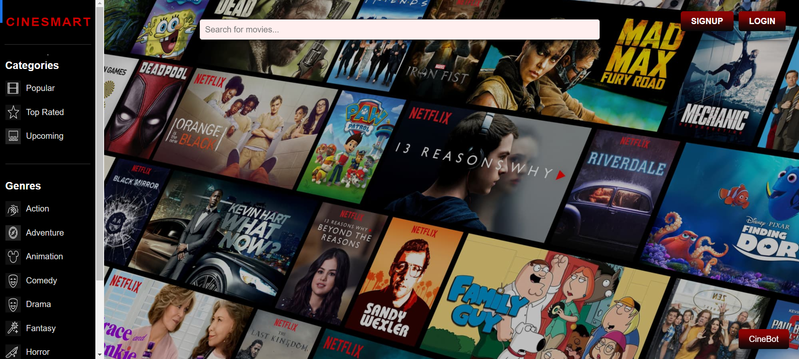
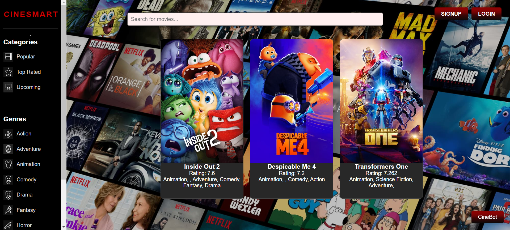
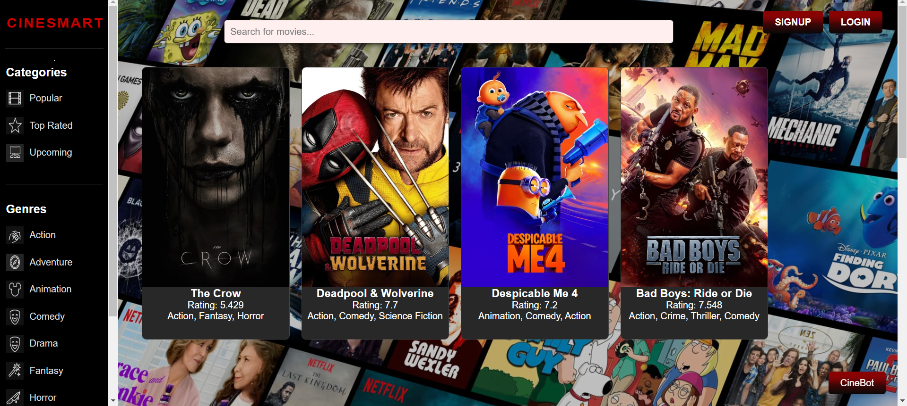
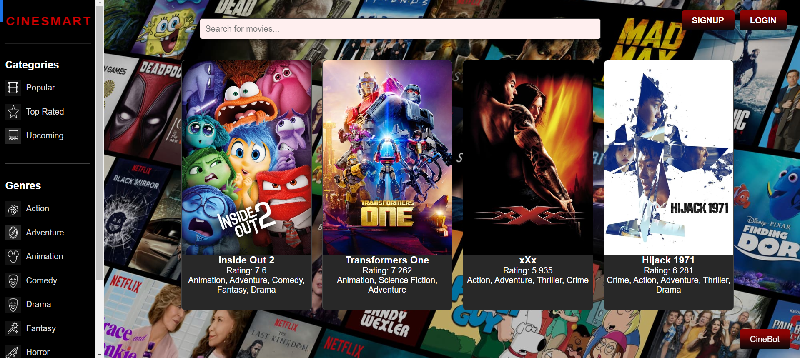
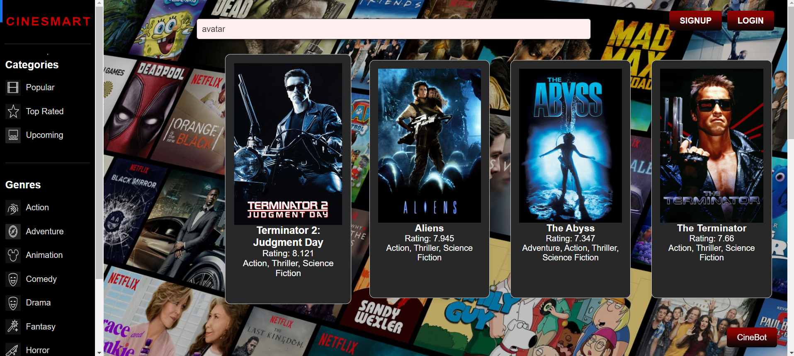

# CINESMART

Welcome to **CINESMART**, a movie listing website that allows users to browse movies by categories and genres, and log in or sign up for personalized features. It also includes a chatbot feature, **CineBot**, for an interactive experience.

## Table of Contents

- [Features](#features)
- [Installation](#installation)
- [Usage](#usage)
- [Screenshots](#screenshots)
- [Technologies Used](#technologies-used)
- [Contributing](#contributing)
- [License](#license)

---

## Features

- **Movie Listing**: Browse movies by categories like "Popular", "Top Rated", and "Upcoming".
- **Genres**: Explore movies by genres such as Action, Adventure, Comedy, etc.
- **Search**: Search for your favorite movies through the search bar.
- **Authentication**: Users can sign up and log in to enjoy additional features.
- **Chatbot (CineBot)**: A chatbot for movie recommendations or general queries.
- **Responsive Design**: Optimized for various screen sizes.

---

## Installation

1. **Clone the repository**:

    ```bash
    git clone https://github.com/yourusername/cinesmart.git
    ```

2. **Navigate to the project directory**:

    ```bash
    cd cinesmart
    ```

3. **Install dependencies** (if applicable, e.g., for Flask or Django backend):

    ```bash
    pip install -r requirements.txt
    ```

4. **Run the project** (assuming a Flask backend):

    ```bash
    flask run
    ```

5. **Open in your browser**:

    ```
    http://localhost:5000
    ```

---

## Usage

Once the project is running, open the application in your browser. You will see a header with the **CINESMART** logo, a sidebar with categories and genres, and a main section with the search bar and movie listings.

### Search Functionality

- Use the search bar to filter movies based on keywords.

### Signup & Login

- Click on the **Signup** or **Login** buttons to register or access your account.

### Chatbot

- Click the **CineBot** button at the bottom right to launch the chatbot.

---

## Screenshots













---

## Technologies Used

- **HTML5**: Markup for the website.
- **CSS3**: Styling for a responsive design.
- **JavaScript**: For dynamic features and interactions.
- **Flask**: Backend framework.
- **SQLAlchemy**: Database ORM for Flask.
- **TMDB API**: Movie data source.

